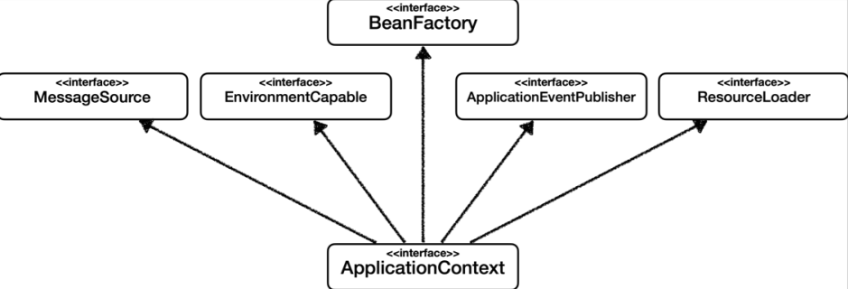

# 1장 - 오브젝트와 의존관계

## 초난감 DAO

```
@Getter
@Setter
public class User {
  String id;
  String name;
  String password;
}
```

`JavaBean` 규악을 따르고 사용자 정보를 저장하는 `User` 클래스를 생성한다.

### JavaBean

- 멤버 변수마다 별도의 getter/setter method 가 존재
- getter method 는 매개변수가 존재하지 않는다
- setter method 는 반드시 하나 이상의 매개변수가 존재한다
- construct 는 매개변수가 존재하지 않는다

#### 디폴트 생성자

`javaBean` 은 파라미터가 없는 `default construct` 를 갖고 있어야 한다. 프레임워크에서 리플렉션을 이용해 오브젝트를 생성하기 때문에 필요하다

#### Reflection API란?

마법처럼 클래스의 이름만으로도 해당 클래스의 정보를 가져올 수 있다.

#### 어떻게 가능할까?

자바에서는 JVM이 실행되면 사용자가 작성한 자바 코드가 컴파일러를 거쳐 바이트 코드로 변환되어 `static` 영역에 저장된다.
`Reflection API` 는 이 정보를 활용한다. 그래서 클래스 이름만 알고 있다면 언제든 static 영역을 뒤져서 정보를 가져올 수 있는 것이다.

> Spring Data JPA 에서 Entity에 기본 생성자가 필요한 이유도 동적으로 객체 생성시 Reflection API를 활용하기 때문

### main()을 이용한 DAO 테스트 코드

```
public class UserDao {

  public void add(User user) throws ClassNotFoundException, SQLException {
    Class.forName("com.mysql.jdbc.Driver");
    Connection c = DriverManager.getConnection(
        "jdbc:mysql://localhost/springbook", "root", "1234");

    PreparedStatement ps = c.prepareStatement(
        "insert into users(id,name,password) values(?,?,?)");
    ps.setString(1, user.getId());
    ps.setString(2, user.getName());
    ps.setString(3, user.getPassword());

    ps.executeUpdate();

    ps.close();
    c.close();
  }

  public User get(String id) throws ClassNotFoundException, SQLException {
    Class.forName("com.mysql.jdbc.Driver");
    Connection c = DriverManager.getConnection(
        "jdbc:mysql://localhost/springbook", "root", "1234");

    PreparedStatement ps = c.prepareStatement(
        "select * from users where id = ?");

    ps.setString(1, id);

    ResultSet rs = ps.executeQuery();
    rs.next();
    User user = new User();
    user.setId(rs.getString("id"));
    user.setName(rs.getString("name"));
    user.setPassword(rs.getString("password"));

    rs.close();
    ps.close();
    c.close();

    return user;
  }

  public static void main(String[] args) throws SQLException, ClassNotFoundException {
    UserDao dao = new UserDao();

    User user = new User();
    user.setId("minsoo");
    user.setName("김민수");
    user.setPassword("hello");

    dao.add(user);

    System.out.println("user.getId() =" + user.getId());

    User user2 = dao.get(user.getId());

    System.out.println("user2.getName() = " + user2.getName());
    System.out.println("user2.getPassword() = " + user2.getPassword());
    System.out.println("user2.getId() = " + user2.getId());
  }
}
```

실제 프로젝트에서 자바 개발자가 이렇게 DAO를 개발했다면 개발팀에서 바로 쫒겨나지 않을까 싶을 만큼 한심한 코드다. 이제부터 이 문제 많은 초난감 DAO 코드를 객체지향 기술 원리에 충실한 멋진 스프링 스타일의
코드로 개선할 것이다.

## 관심사의 분리

개발자가 객체를 설계할 때 가장 염두에 둬야 할 사항은 바로 `미래의 변화를 어떻게 대비할 것인가` 이다.
`분리와 확장을 고려한 설계` 를 한다면 변경이 일어날 때 필요한 작업을 최소화 하고, 그 변경이 다른곳에 문제를 일으키지 않게 할 수 있다.

- 예)
    - 로그의 날짜 포맷을 6자리 -> 8자리로 변경
    - DB를 오라클 -> MySQL으로 변경

프로그래밍 기초 개념 중에 `관심사의 분리` 라는 게 있다. 이를 객체 지향에 적용해보면 관심이 같은 것 끼리는 하나의 객체 안으로 또는 친한 객체로 모이게 하고, 관심이 다른 것은 가능한 한 따로 떨어져서 서로
영향을 주지 않도록 분리하는 것이라고 생각할 수 있다.

### SOLID 원칙

클린코드로 유명한 로버트 마틴이 좋은 객체 지향 설계의 5가지 원칙을 정리

#### SRP : 단일 책임 원칙(Single Responsibility Principle)

한 클래스는 하나의 책임만 가져야 한다

#### OCP : 개방-폐쇄 원칙 (Open/Closed Principle)

소프트웨어 요소는 확장에는 열려 있으나 변경에는 닫혀 있어야 한다

#### LSP : 리스코프 치환 원칙 (Liskov Substitution Principle)

프로그램이 객체는 프로그램의 정확성을 깨뜨리지 않으면서 하위 타입의 인스턴스로 바꿀 수 있어야 한다

- 예) 자동차 인터페이스의 엑셀은 앞으로 가라는 기능, 뒤로 가게 구현하면 LSP 위반, 느리더라도 앞으로 가야함

#### ISP : 인터페이스 분리 원칙 (Interface Segregation Principle)

특정 클라이언트를 위한 인터페이스 여러 개가 범용 인터페이스 하나보다 낫다

#### DIP : 의존관계 역전 원칙 (Dependency Inversion Principle)

구현 클래스에 의존하지 말고, 인터페이스에 의존하라는 뜻

### 상속을 통한 확장

```
  public abstract class UserDao {

  public void add(User user) throws ClassNotFoundException, SQLException {
    Connection c = getConnection();
    ...
  }

  public User get(String id) throws ClassNotFoundException, SQLException {
    Connection c = getConnection();
    ...
  }

  public abstract Connection getConnection() throws ClassNotFoundException, SQLException;

  public class NUserDao extends UserDao {

    @Override
    public Connection getConnection() throws ClassNotFoundException, SQLException {
      // N사 DB connection 생성코드
      return null;
    }
  }

  public class DUserDao extends UserDao {

    @Override
    public Connection getConnection() throws ClassNotFoundException, SQLException {
      // D사 DB connection 생성코드
      return null;
    }
  }
}
```

클래스 계층 구조를 통해 두 개의 관심이 독립적으로 분리되면서 변경 작업이 한층 용이해졌다.

상속을 통해 슈퍼 클래스에 기본적인 로직의 흐름을 만들고, 그 기능의 일부를 추상 메소드나 오버라이딩이 가능한 메소드 등으로 만든 뒤 서브 클래스에서 필요에 맞게 구현해서 사용하는 방법을 `템플릿 메소드 패턴`
이라고 한다.

하지만 슈퍼 클래스의 내부의 변경이 있을 때 모든 서브 클래스를 함께 수정하거나 다시 개발해야 될 수도 있다.

## DAO의 확장

클래스를 분리하면서도 이런 문제를 해결할 수는 없을까? 바로 인터페이스의 도입이다. 인터페이스에는 어떻게 하겠다는 방법은 나타나 있지 않다. 그것은 인터페이스를 구현한 클래스들이 알아서 결정할 일이다.

다형성을 이용해서 기존 코드를 개선해보자.

```
public interface ConnectionMaker {
  Connection makeConnection() throws ClassNotFoundException, SQLException;
}

public class DConnectionMaker implements ConnectionMaker{

  @Override
  public Connection makeConnection() throws ClassNotFoundException, SQLException {
    return null;
  }
}

public class NConnectionMaker implements ConnectionMaker{

  @Override
  public Connection makeConnection() throws ClassNotFoundException, SQLException {
    return null;
  }
}

public class UserDao {

  private ConnectionMaker connectionMaker;

  public UserDao(ConnectionMaker connectionMaker) {
    this.connectionMaker = connectionMaker;
  }
  
    public static void main(String[] args) throws SQLException, ClassNotFoundException {
    ConnectionMaker connectionMaker = new DConnectionMaker();

    UserDao dao = new UserDao(connectionMaker);
  }
}
```

앞에서 사용했던 상속을 통한 확장 방법보다 더 깔끔하고 유연한 방법으로 UserDao와 ConnectionMaker 클래스들을 분리하고, 서로 영향을 주지 않으면서도 필요에 따라 자유롭게 확장할 수 있는 구조가
됐다.

개선한 구조를 디자인 패턴의 시각으로 보면 `전략 패턴` 에 해당한다고 볼 수 있다. `전략 패턴` 은 디자인 패턴의 꽃이라고 불릴 만큼 다양하게 자주 사용되는 패턴이다.

## 제어의 역전(IoC)

```
public class DaoFactory {

  public UserDao userDao() {
    ConnectionMaker connectionMaker = new DConnectionMaker();
    return new UserDao(connectionMaker);
  }

  public AccountDao accountDao() {
    return new AccountDao(connectionMaker());
  }

  public MessageDao messageDao() {
    return new MessageDao(connectionMaker());
  }

  private ConnectionMaker connectionMaker() {
    return new DConnectionMaker();
  }
}

public interface ConnectionMaker {
  Connection makeConnection() throws ClassNotFoundException, SQLException;
}

  public static void main(String[] args) throws SQLException, ClassNotFoundException {
    UserDao dao = new DaoFactory().userDao();
    User user = new User();
  }
```

제어의 역전이라는 개념에 대해 알아보자, 제어의 역전이라는 건, 간단히 프로그램의 제어 흐름 구조가 뒤바뀌는 것이라고 설명할 수 있다. 일반적으로 프로그램의 흐름은 main() 메소드와 같이 프로그램이 시작되는
지점에서 다음에 사용할 오브젝트를 결정하고, 결정한 오브젝트를 생성하고, 만들어진 오브젝트에 있는 메소드를 호출하고, 그 오브젝트 메소드 안에서 다음에 사용할 것을 결정하고 호출하는 식의 작업이 반복된다.
`제어의 역전` 이란 이런 제어 흐름의 개념으로 거꾸로 뒤집는 것이다. 제어의 역전에서는 오브젝트가 자신이 사용할 오브젝트를 스스로 사용하지 선택하지 않는다. 당연히 생성하지도 않는다. `DaoFactory` 를
통해 IoC를 적용하는 작업을 한 것이다.

## 스프링의 IoC

스프링에서는 `애플리케이션 컨텍스트` 를 `IoC 컨테이너` 라고 부르기도 하고, `스프링 컨테이너` 라고 부르기도 한다. 또는 `빈 팩토리` 라고 부를 수도 있다.
`applicationContext` 인터페이스는 `beanFactory` 인터페이스를 상속했으므로 일종의 `beanFactory` 인 셈이다.

### ApplicationContext의 부가 기능



- 메시지소스를 활용한 국제화 기능
    - 예를 들어서 한국에서 들어오면 한국어로, 영어권에서 들어오면 영어로 출력
- 환경변수
    - 로컬, 개발, 운영등을 구분해서 처리
- 애플리케이션 이벤트
    - 이벤트를 발행하고 구독하는 모델을 편리하게 지원
- 편리한 리소스 조회
    - 파일, 클래스패스, 외부 등에서 리소스를 편리하게 조회

## 싱글톤 레지스트리와 오브젝트 스코프

애플리케이션 컨텍스트는 우리가 만들었던 오브젝트 팩토리와 비슷한 방식으로 동작하는 IoC 컨테이너다. 그러면서 동시에 이 애플리케이션 컨텍스트는 싱글톤을 저장하고 관리하는 `싱글톤 레지스트리` 이기도 하다.

### 왜 스프링은 싱글톤으로 빈을 만드는 것일까?

매번 클라이언트 요청이 올 때 마다 각 로직을 담당하는 오브젝트를 새로 만든다고 생각해보자. 요청 한번에 100개의 오브젝트가 만들어진다면? 감당하기 힘들다.

그래서 서블릿은 대부분 멀티스레드 환경에서 싱글톤으로 동작한다.

## 의존관계 주입(DI)

의존관계 주입이랑 다음과 같은 세 가지 조건을 충족하는 작업을 말한다.

- 클래스 모델이나 코드에는 런타임 시점의 의존관계가 드러나지 않는다. 그러기 위해서는 인터페이스에만 의존하고 있어야 한다
- 런타임 시점의 의존관계는 컨테이너나 팩토리 같은 제3의 존재가 결정한다
- 외좐관계는 사용할 오브젝트에 대한 레퍼런스를 외부에서 제공해줌으로써 만들어진다

### DI 받는다

DI의 동작방식은 이름 그대로의 외부로부터의 주입니다. 단순한 오브젝트 주입이 아니라 DI 개념을 따르는 주입임을 강조하는 것이라고 이해하면 된다.


