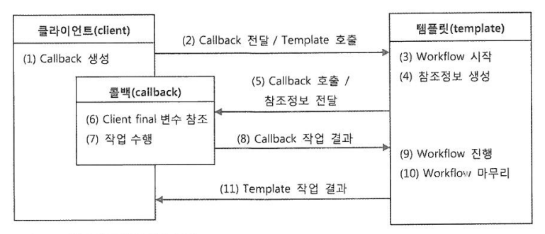

# 3장 - 템플릿

확장에는 자유롭게 열려 있고 변경에는 굳게 닫혀 있다는 객체지향 설계 핵심 원칙인 `개방 폐쇠 원칙` 을 다시 한번 생각해보자. 이 원칙은 코드에서 어떤 부분은 변경을 통해 그 기능이 다양해지고 확장하려는 성질이
있고, 어떤 부분은 고정되어 있고 변하지 않으려는 성질이 있음을 말해준다. 다른 목적과 다른 이유에 의해 다른 시점에 독립적으로 변경될 수 있는 효율적인 구조를 만들어주는 것이 바로 `개방 폐쇠 원칙` 이다.

템플릿이란 바뀌는 성질이 다른 코드 중에서 변경이 거의 일어나지 않으며 일정한 패턴으로 유지되는 특성을 가진 부분을 자유롭괴 변경되는 성질을 가진 부분으로부터 독립시켜서 효과적으로 활용할 수 있도록 하는 기법이다.

## 템플릿 메소드 패턴의 적용

템플릿 메소드 패턴은 상속을 통해 기능을 확장해서 사용하는 부분이다. 변하지 않는 부분은 슈퍼클래스에 두고 변하는 부분은 추상 메소드로 정의해둬서 서브클래스에서 오버라이드 하여 새롭게 정의해 쓰도록 하는 것이다.

### 템플릿 메소드의 단점

가장 큰 문제는 로직마다 상속을 통해 새로운 클래스를 만들어야 하는 점이다. 템플릿 메소드 패턴을 사용한다면 JDBC 로직이 4개일 경우 4개의 서브클래스를 만들어서 사용해야 한다. 템플릿 메소드는 `상속` 을
사용하기 때문에 `상속` 에서 오는 단점들을 그대로 안고간다. 특히 슈퍼클래스와 서브클래스가 컴파일 시점에 강하게 결합되는 문제가 있다. 이러한 템플릿 메소드의 단점을 개선하기 위한 대체 수단으로 `전략 패턴` 을
많이 사용한다.

## 전략 패턴

`개방 폐쇠 원칙` 을 잘 지키는 구조이면서도 템플릿 메소드 패턴보다 유연하고 확장성이 뛰어난 것이, 오브젝트를 아예 둘로 분리하고 클래스 레벨에서는 인터페이스를 통해서만 의존하도록 만드는 전략 패턴이다. 전략
패턴은 OCP 관점에서 보면 확장에 해당하는 변하는 부분을 별도의 클래스로 만들어 추상화된 인터페이스를 통해 위임하는 방식이다. 결국 DI 란 이러한 전략 패턴의 장점을 일반적으로 활용할 수 있도록 만든 구조라고 볼
수 있다.

## 인터페이스를 사용하지 않고 DI 를 적용하는 것은 문제가 있지 않을까?

의존관계 주입이라는 개념을 충실히 따르자면, 인터페이스를 사이에 둬서 클래스 레벨에서는 의존관계가 고정되지 않게 하고, 런타임 시에 의존할 오브젝트와의 관계를 다이내믹하게 주입해주는 것이 맞다.

인터페이스가 없다는건 클래스가 서로 매우 긴밀한 관계를 가지고 강하게 결합되어 있다는 의미다. 비록 클래스는 구분되어 있지만 이 둘은 강한 응집도를 갖고 있다. 만약 UserDao 가 JDBC 방식 대신 JPA 나
하이버네이트 같은 ORM 을 사용해야 한다면 JdbcContext 도 통째로 바뀌어야 한다. 이런 클래스를 바로 사용하는 코드 구성을 DI 에 적용하는 것은 가장 마지막 단계에서 고려해볼 사항임을 잊지 말자. 그저
인터페이스를 만들기 귀찮으니까 클래스를 사용하자는 건 잘못된 생각이다.

## 템플릿과 콜백

`템플릿/콜백 패턴` 이란 전략 패턴의 기본 구조에 익명 내부 클래스를 활용한 방식이다. 전략 패턴의 컨텍스트를 템플릿이라 부르고, 익명 내부 클래스로 만들어지는 오브젝트를 콜백이라고 부른다.

> 템플릿은 어떤 목적을 위해 미리 만들어둔 모양이 있는 틀을 가리킨다
>
> 콜백은 실행되는 것을 목적으로 다른 오브젝트의 메소드에 전달되는 오브젝트를 말한다

### 템플릿/콜백의 특징

여러개의 메소드를 가진 일반적인 인터페이스를 사용할 수 있는 전략 패턴의 전략과 달리 템플릿/콜백 패턴은 보통 단일 메소드 인터페이스를 사용한다.

- 클라이언트의 역할은 템플릿 안에서 실행될 로직을 담은 콜백 오브젝트를 만들고, 콜백이 참조할 정보를 제공하는 것이다. 만들어진 콜백은 클라이언트가 템플릿 메소드를 호출할 때 파라미터로 전달된다
- 템플릿은 정해진 작업 흐름을 따라 작업을 진행하다가 내부에서 생성한 참조정보를 가지고 콜백 오브젝트의 메소드를 호출한다. 콜백은 클라이언트 메소드에 있는 정보와 템플릿이 제공한 참조정보를 이용해서 작업을 수행하고
  그 결과를 다시 템플릿에 돌려준다
- 템플릿은 콜백이 돌려준 정보를 사용해서 작업을 마저 수행한다. 경우에 따라 최종 결과를 클라이언트에 다시 돌려주기도 한다

`템플릿/콜백 패턴` 은 전략 패턴과 DI의 장점을 익명 내부 클래스 사용 전략과 결합한 독특한 활용법이라고 이해할 수 있다. 단순히 전략 패턴으로만 보기엔 독특한 특징이 많으므로 템플릿/콜백을 하나의 고유한 디자인
패턴으로 기억해두면 편리하다. 다만 이 패턴애 녹아있는 전략 패턴과 수동 DI를 이해할 수 있어야 한다.

## 정리

스프링의 내부는 다양한 디자인 패턴 기법으로 설계되어 있다. 개발자는 각 디자인 패턴을 이해하고 차이점을 명확히 구분할 수 있어야 한다. `템플릿/콜백 패턴` 은 스프링이 객체지향 설계와 프로그래밍에 얼마나 가치를
두고있는지를 잘 보여주는 예다. 스프링이 제공하는 `템플릿/콜백 패턴` 을 잘 사용해야 하는 것은 물론이며 직접 `템플릿/콜백 패턴` 을 만들어 활용할 수도 있어야 한다. 토비의 스프링을 공부하면서 결국 객체지향
설계 원리와 디자인 패턴, DI 등의 개념이 충분히 숙지되어야 깔끔하고 유연하며 단순한 코드를 설계 할 수 있는 것 같다.   