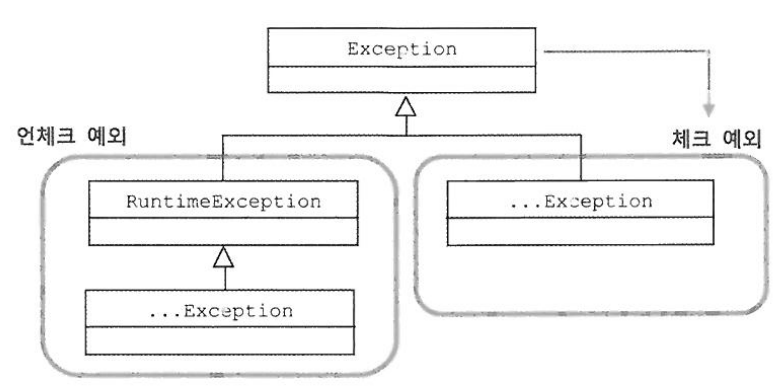

# 4장 - 예외

## 초난감 예외처리

### 초난감 예외처리 코드 1

```
try {
    ...
}
catch(SQLException e){
}
```

예외를 잡고는 아무것도 하지 않는 코드이다. 예외 발생을 무시해버리고 정상적인 상황인 것처럼 다음 라인으로 넘어가겠다는 분명한 의도가 있는 게 아니라면 연습 중에도 절대 만들어서는 안 되는 코드다.

### 초난감 예외처리 코드 2

```
} catch(SQLException e) {
    System.out.println(e);
}
```

### 초난감 예외처리 코드 3

```
} catch(SQLException e) {
    e.printStackTrace();
}
```

예외가 발생하면 화면에 출력해주는데 뭐가 문제일까? 운영서버로 올라가면 콘솔 로그를 누군가가 계속 모니터링하지 않는 한 이 예외 코드는 심각한 폭탄으로 남아 있을 것이다.

예외를 처리할 때 반드시 지켜야 할 핵심 원칙은 한 가지다. 모든 예외는 적절하게 복구되든지 아니면 작업을 중단시키고 운영자 또는 개발자에게 분명하게 통보되야 한다.

### 초난감 예외처리 코드 4

```
public void method1() throws Exception { <-- 예외
    method2(); <-- 호출
}

public void method2() throws Exception { <-- 예외    
    method3(); <-- 호출
}

public void method3() throws Exception { <-- 예외
```

콜백과 템플릿처럼 긴밀하게 역할을 분담하고 있는 관계가 아니라면 자신의 코드에서 발생하는 예외를 그냥 던져버리는 건 무책임한 책임회피이다. 예외를 무시해버리는 첫 번째 문제보다는 낫다고 하지만 이런 코드도 매우 안
좋은 예외처리 방법이다. 이 두 가지 나쁜 습관은 어떤 경우에도 용납하지 않아야 한다.

## 체크 예외와 언체크 예외

`java.lang.Exception` 클래스와 그 서브클래스로 정의되는 예외들은 에러와 달리 개발자들이 만든 애플리케이션 코드의 작업 중에 예외상황이 발생했을 경우에 사용된다.

Exception 클래스는 다시 `체크 예외` 와 `언체크 예외` 로 구분된다. 전자는 Exception 클래스의 서브클래스이면서 RuntimeException 클래스를 상속하지 않은 것들이고, 후자는
RuntimeException 을 상속한 클래스들을 말한다.



### 체크 예외

일반적으로 예외라고 하면 Exception 클래스의 서브클래스 중에서 RuntimeException 을 상속하지 않는 것만을 말하는 체크 예외라고 생각해도 된다.

체크 예외가 발생할 수 있는 메소드를 사용할 경우 반드시 예외를 처리하는 코드와 함께 작성해야 한다. IOException 이나 SQLException 을 비롯해서 예외적인 상황에서 던져질 가능성이 있는 것들
대부분이 체크 예외로 만들어져 있다.

### 언체크 예외

`java.lang.RuntimeException` 클래스를 상속한 예외들은 명시적인 예외처리를 강제하지 않기 때문에 언체크 예외라고 불린다. 대표 클래스 이름을 따서 런타임 예외라고도 한다. 이 런타임 예외는
catch 문으로 잡거나 throw 로 선언하지 않아도 된다. 물론 명시적으로 잡거나 throw 로 선언해줘도 상관없다.

## 스프링에서의 예외 처리

### @ControllerAdvice, @ExceptionHandler

`@Controller` 나 `@RestController` 에서 발생한 예외를 전역으로 관리하고 처리할 수 있게 도와주는 어노테이션이다. `@ExceptionHandler` 는 컨트롤러로 등록된 `Bean` 에서
발생하는 예외를 캐치하여 `@ExceptionHandler` 붙은 메소드에서 예외를 처리한다.

`@ControllerAdvice + @ExceptionHandler` 조합을 사용하면 패키지 전역의 컨트롤러에서 발생하는 모든 예외를 관리할 수 있다는 장점이 있다.

### 체크 예외와 언체크 예외 Rollback

- 체크 예외
    - Transaction 기본 롤백 대상이 아니라서 롤백 처리를 하려면 추가 처리가 필요하다
    - 컴파일 단계에서 체크

- 언체크 예외
    - @Transactional rollbackFor 에 기본 옵션으로 들어가있어 예외 발생시 롤백 처리
    - 런타임 단계에서 체크

## 정리

예외를 잡아서 아무런 처리를 하지 않거나 의미 없는 throw 선언을 남발하는 것은 위험하다. 예외는 복구하거나 예외처리 오브젝트로 의도적으로 전달하거나 적절한 예외로 전환해야 한다. 체크 예외와 언체크 예외의
차이점을 정확히 구분할 줄 알고 상황에 맞는 오류 처리를 해주는 것이 좋은 애플리케이션을 만들기 위한 개발자의 역할이다. 
