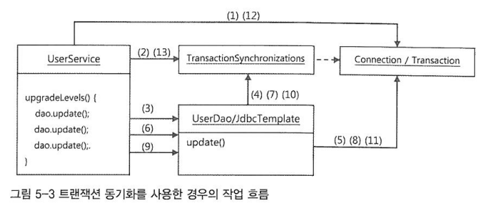

# 5장 - 서비스 추상화

## 상수보다는 열거형을 사용하자

`Enum Class` 은 열거형이라고 불리며, 서로 연관된 상수들의 집합을 의미합니다.

### Enum Class 의 장점

- Enum Class 는 완벽한 싱글톤이다
- Thread-safety, Serialization 이 보장된다

## 기존 코드의 문제점

비즈니스 로직의 코드를 테스트도 만들어서 꼼꼼하게 점검했지만, 깔끔한 코드를 추구하는 스프링 사용자답게 만들어진 코드를 다시 한번 검토해보자.

- 코드에 중복된 부분은 없는가?
- 코드가 무엇을 하는 것인지 이해하기 불편하지 않은가?
- 코드가 자신이 있어야 할 자리에 있는가?
- 앞으로 변경이 일어난다면 어떤 것이 있을 수 있고, 그 변화에 쉽게 대응할 수 있게 작성되어 있는가?

## 트랜잭션

### 트랜잭션 경계설정

데이터베이스는 그 자체로 완벽한 트랜잭션을 지원한다. 하나의 SQL 명령은 일부가 수정되거나 삭제되는 일이 없다. 하지만 여러 개의 SQL 이 사용되는 작업을 하나의 트랜잭션으로 취급해야 하는 경우가 있다.

### 트랜잭션 동기화

트랜잭션 동기화란 클래스에서 트랜잭션을 시작하기 위해 만든 Connection 오브젝트를 특별한 저장소에 보관해두고, 이후에 호출되는 DAO 의 메소드에서는 저장된 Connection 을 가져다가 사용하게 하는
것이다.

## 단일 책임 원칙

단일 책임 원칙은 객체지향의 설계 원칙 중 하나이다. 단일 책임 원칙은 하나의 모듈은 한가지 책임을 가져야 한다는 의미다.

### 단일 책임 원칙의 장점

단일 책임 원칙을 잘 지키고 있다면, 어떤 변경이 필요할 때 수정 대상이 명확해진다. 기술이 바뀌면 기술 계층과의 연동을 담당하는 기술 추상화 계층의 설정만 바꿔주면 된다. 객체지향 설계와 프로그래밍의 원칙은 서로
긴밀하게 관련이 있다. 단일 책임을 잘 지키는 코드를 만들려면 인터페이스를 도입하고 이를 DI로 연결해야 하며, 그 결과로 단일 책임 원칙뿐 아니라 개방 폐쇄 원칙도 잘 지키고, 모듈 간에 결합도가 낮아서 서로의
변경이 영향을 주지 않고, 같은 이유로 변경이 단일 책임에 집중되는 응집도 높은 코드가 나오니까 말이다. 이런 과정에서 전략 패턴, 어댑터 패턴, 브릿지 패턴, 미디에이터 패턴 등 많은 디자인 패턴이 자연스럽게
적용되기도 한다. 객체지향 설계 원칙을 잘 지켜서 만든 코드는 테스트하기도 편하다.

### 스프링의 DI

적절하게 책임과 관심이 다른 코드를 분리하고, 서로 영향을 주지 않도록 다양한 추상화 기법을 도입하고, 애플리케이션 로직과 기술/환경을 분리하는 등의 작업은 갈수록 복잡해지는 애플리케이션에는 반드시 필요하다. 이를
위한 핵심적인 도구가 바로 스프링이 제공하는 DI다.

DI의 원리를 잘 활용해서 스프링을 열심히 사용하다 보면, 어느 날 자신이 만든 코드에 객체지향 원칙과 디자인 패턴의 장점이 잘 녹아 있다는 사실을 발견하게 될 것이다. 그것이 스프링을 사용함으로써 얻을 수 있는
가장 큰 장점이다.

## 테스트 오브젝트

테스트용으로 사용되는 특별한 오브젝트들이 있다. 테스트 환경을 만들어주기 위해, 테스트 대상이 되는 오브젝트의 기능에만 충실하게 수행하면서 빠르게, 자주 테스트를 실행할 수 있도록 사용하는 이런 오브젝트를
통틀어서 `테스트 대역` 이라고 부른다. 대표적인 테스트 대역은 `테스트 스텁` 이다. 테스트 스텁은 테스트 대상 오브젝트의 의존객체로서 존재하면서 테스트 동안에 코드가 정상적으로 수행할 수 있도록 돕는 것을
말한다.

## 정리

비즈니스 로직을 담은 코드는 데이터 액세스 로직을 담은 코드와 깔끔하게 분리되는 것이 바람직하다. 비즈니스 로직 코드 또한 내부적으로 책임과 역할에 따라서 깔끔하게 메소드로 정리돼야 한다. 책에서 지속적으로 객체지향
원칙, 스프링 DI의 중요성을 강조하고 있다. 서비스를 아름답게 추상화 하기 위해서는 결국 `객체지향 원칙` 과 `스프링의 DI` 를 잘 숙지해야 한다.